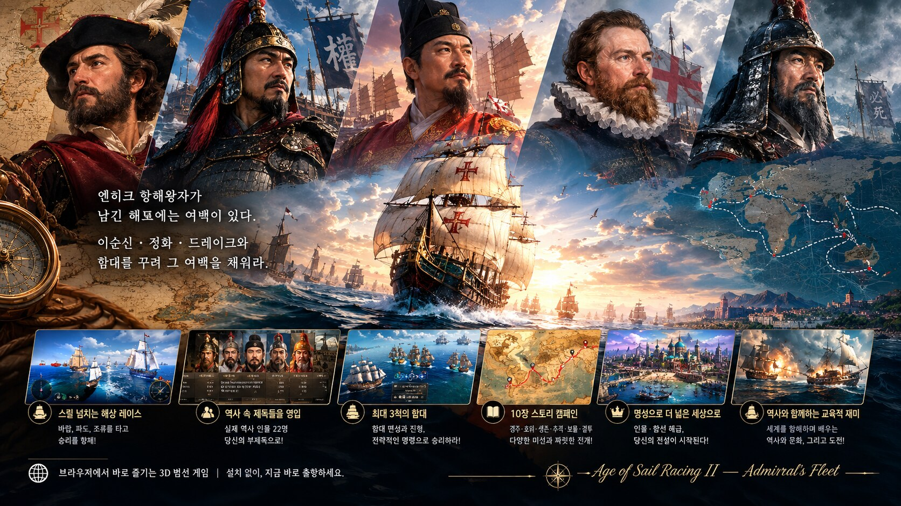

# 대항해시대 레이싱 2

**Age of Sail Racing II — Admiral's Fleet**

> 엔히크 항해왕자가 남긴 해도에는 여백이 있다.
> 이순신·정화·드레이크와 함대를 꾸려 그 여백을 채워라.



브라우저에서 바로 즐기는 3D 범선 게임입니다. 혼자 달리던 [1편](https://github.com/leaf-kit/game-ocean-racing)과 달리, 이번에는 **역사 속 제독들을 부제독으로 영입해 함대를 꾸리고**, **열한 장의 스토리 캠페인**을 따라 세계를 항해합니다. 등장 인물의 초상은 실제 역사 자료입니다.

마지막 장의 무대는 2026년 가을의 부산입니다. 북항 친수공원 수로에 들어와 보름 넘게 떠나지 않은 상어 한 마리에게 사람들이 **부캉이**라는 이름을 붙였고, 부산시는 명예 홍보대사로 위촉했습니다. [**부캉이의 바다**](#부캉이의-바다) 맵은 그 이야기에서 왔습니다. 여기서는 포를 쏘지 않습니다. 겁주지 않고 바다로 데려가는 것이 목표입니다.

## ▶ 바로 플레이

**https://leaf-kit.github.io/game-ocean-racing2/**

설치 없이 브라우저에서 바로 실행됩니다. (Chrome 권장, WebGL 필요)

---

## 1편에서 바뀐 것

1편은 "함선을 골라 세계를 세 바퀴 도는 레이싱"이었습니다. 콘텐츠는 많았지만 **한 판이 길고, 목표가 완주 하나뿐이고, 역사 자료는 읽을거리로만 붙어 있었습니다.** 2편은 그 세 가지를 바꾸는 데서 출발했습니다.

| | 1편 | 2편 |
|---|---|---|
| **구조** | 자유 레이스 한 종류 | **11장 스토리 캠페인** + 자유 항해 |
| **한 판 길이** | 3랩 세계 일주 (길다) | 장마다 **3~5분**, 목표가 매번 다르다 |
| **목표** | 완주 / 순위 | 경주 · 호위 · 생존 · 추격 · 보물 · 결투 · 유도 **7종** |
| **동료** | 없음 (AI는 장애물) | **함대** — 동료함 최대 3척, 진형과 명령 |
| **역사 인물** | 캔버스로 그린 도형 초상 12명 | **역사 인물 25명**, 영입해 함대에 배치 |
| **진행** | 저장 없음 | **명성(Fame)** 으로 인물·함선 해금, 장별 등급 기록 |
| **시작까지** | 함선 21종 + 초상 12명 + 옵션 5개 | 타이틀에서 **한 번 눌러 바로 1장** |
| **바다** | 섬과 암초와 크라켄 | 맵 **13종**(바다 7 · 강 6). 부캉이의 바다에는 크라켄 대신 **동물 8종**이 산다 |

---

## 스토리

1497년 리스본. 사그레스에서 마흔 해를 보낸 엔히크 항해왕자가 해도 한 장을 내민다. 아프리카 서해안까지는 채워져 있고, 그 아래는 비어 있다.

> "나는 늙었고, 이 여백을 채울 사람은 내가 아니야. 오늘 아침 테주 강에 뜬 배 중 하나가 그 일을 할 걸세."

당신은 이름 없는 제독으로 출항해, 기항지마다 한 사람을 만난다. 희망봉 앞바다에서 자신의 배와 함께 가라앉은 **디아스**, 네 척으로 떠나 두 척으로 돌아온 **다 가마**, 삼백 척의 함대를 이끌고도 그 배를 모두 태워야 했던 **정화**, 울돌목의 물살 속에서 열두 척으로 버틴 **이순신**, 아무도 돌아온 적 없는 태평양을 동쪽으로 건넌 **우르다네타**.

그들은 저마다 해도의 한 조각과, 자신의 이름을 당신의 함대에 남긴다. 열 장이 끝나고 해도에 빈칸이 없어질 때, 바다의 왕관이 주인을 찾는다.

왕관을 쓰고 나면 한 장이 더 남아 있다. 2026년 가을의 부산 북항이다. 여기서는 포를 쏘지 않는다.

### 11장

| 장 | 제목 | 무대 | 미션 | 만나는 인물 |
|:-:|---|---|:-:|---|
| 1 | **리스본, 새벽 항구** | 1497년 7월 · 테주 강 어귀 | 🏁 경주 | 엔히크 항해왕자 |
| 2 | **폭풍의 곶** | 1500년 5월 · 아프리카 남단 | ⛈ 생존 | 바르톨로메우 디아스 |
| 3 | **인도 항로** | 1498년 5월 · 캘리컷 앞바다 | 🛡 호위 | 바스코 다 가마 |
| 4 | **말라카의 길목** | 1511년 8월 · 말라카 해협 | 🎯 추격 | 아폰수 드 알부케르크 |
| 5 | **울돌목** | 1597년 9월 16일 · 명량 | ⛈ 생존 | 이순신 |
| 6 | **보선(寶船)의 그림자** | 1433년 · 남중국해 | 🏁 경주 | 정화 |
| 7 | **아무도 돌아온 적 없는 바다** | 1565년 6월 · 북태평양 | 🪙 보물 | 안드레스 데 우르다네타 |
| 8 | **보물선단** | 1579년 3월 · 카리브해 | 🎯 추격 | 프랜시스 드레이크 |
| 9 | **붉은 수염** | 1538년 9월 · 프레베자 | ⚔ 결투 | 하이레딘 바르바로사 |
| 10 | **세계 일주** | 1522년 9월 6일 · 산루카르 | 🏁 경주 | 후안 세바스티안 엘카노 |
| 11 | **부캉이** | 2026년 가을 · 부산 북항 | 🦈 유도 | 정약전 |

장마다 **목표**와 **S 등급 조건**이 따로 있습니다. 목표만 채우면 B, 사고 없이 마치면 A, S 조건까지 채우면 S. 등급이 높을수록 명성을 더 받습니다.

| 미션 | 내용 |
|---|---|
| 🏁 **경주** | 정해진 순위 안으로 완주 |
| 🛡 **호위** | 동료함을 정해진 수 이상 살려서 완주 — 한 척이라도 더 잃으면 즉시 실패 |
| ⛈ **생존** | 폭풍과 소용돌이 속에서 제한 시간을 버틴 뒤 완주 |
| 🎯 **추격** | 앞선 라이벌 함선에 정해진 수만큼 포격 명중 |
| 🪙 **보물** | 금화·보물 상자를 정해진 점수만큼 거두고 완주 |
| ⚔ **결투** | 일대일. 제한 시간 안에 상대를 무력화 |
| 🦈 **유도** | 겁주지 않고 동물을 바다로 데려간다. 빠르면 놀라 되돌아간다. 이 미션에서는 포문이 닫힌다 |

---

## 함대

이번 편의 중심입니다. 기함 한 척으로 달리는 게 아니라, **부제독이 지휘하는 동료함 최대 3척**과 함께 항해합니다.

### 규모

**동료함은 최대 9척**까지 거느릴 수 있습니다. 그중 **부제독을 둘 수 있는 자리는 명성에 따라 최대 5명**까지 열리고(캠페인 기준 300 / 800 / 1,600 / 2,800 명성), 부제독이 없는 배는 「동료함 N호」로 따라옵니다. 자유 항해에서는 다섯 자리가 처음부터 열려 있습니다.

### 진형과 간격

출항 전에 진형을 고릅니다. 진형마다 함대 항진이 차는 속도, 동료함이 기함을 지켜 주는 정도, 아이템을 훑는 폭이 다릅니다. 배치는 척수에 맞춰 자동으로 접힙니다 — 종렬진은 7척부터 3열이 되고, 횡렬진은 다섯씩 줄을 나눕니다.

| 진형 | 배치 | 특징 |
|---|---|---|
| **≡ 종렬진**<br><sub>Line Astern</sub> | 한 줄로 뒤따른다 | 바람 그늘이 깊어 **함대 항진이 가장 빨리 찬다** |
| **⋯ 횡렬진**<br><sub>Line Abreast</sub> | 옆으로 나란히 | 금화와 보급품을 **넓게 훑는다** |
| **⋎ 학익진**<br><sub>Crane Wing</sub> | 뒤로 날개를 편다 | 이순신의 포위 진형. 동료함의 **포격이 매서워진다** |
| **⋏ 쐐기진**<br><sub>Wedge</sub> | 동료함이 앞선다 | 암초와 포탄을 **대신 맞아 준다** |

**간격**은 따로 고릅니다.

| 간격 | 배수 | 성격 |
|---|:-:|---|
| **가깝게** | ×0.68 | 바짝 붙는다. 진형이 잘 흐트러지지 않고 함대 항진이 빨리 차지만 서로 부딪히기 쉽다 |
| **보통** | ×1.0 | 기본값. 대열 유지와 기동성이 균형 잡힌다 |
| **멀게** | ×1.45 | 널찍이 펼친다. 금화를 넓게 훑지만 대열을 지키기 어렵다 |

카메라는 진형의 실제 깊이에 맞춰 뒤·위로 물러나 대열이 한 화면에 들어옵니다.

### 함대 항진

동료함이 진형 위치 근처를 유지하면 화면 왼쪽 아래 게이지가 찹니다. 가득 차면 **함대 전체가 동시에 급가속**합니다. 진형이 흐트러지면 게이지는 빠집니다. 동료함이 많을수록 보너스도 큽니다.

### 명령 (1 · 2 · 3)

| 키 | 명령 | 동작 |
|:-:|---|---|
| **1** | ⚔ 돌격 | 앞선 라이벌에게 달려들어 포격한다 |
| **2** | 🛡 방패 | 기함 앞을 가려 암초와 포탄을 대신 맞는다 |
| **3** | 🪙 산개 | 흩어져 금화와 보급품을 거둬 기함에 넘긴다 |

명령은 9초간 유지되고, 각각 재사용 대기가 있습니다.

### 동료함이 하지 않는 것

곡예는 기함의 몫입니다. 동료함은 **점프대·360도 코스터·블랙홀 관문에 스스로 들어가지 않고** 빙 둘러 갑니다 — 그러지 않으면 대열이 매번 흩어집니다. 다만 기함이 블랙홀을 통과하면 함대도 진형 그대로 함께 빨려 나옵니다. 암초에 걸려 한참 뒤처진 배는 잠시 뒤 수평선 너머에서 대열에 합류합니다.

### 동료함의 내구

동료함은 암초·크라켄·적 포격에 내구가 닳고, 0이 되면 **대파**해 돛을 내립니다. 호위 미션에서는 이것이 곧 실패 조건입니다. 조선술 특성(이순신)을 가진 부제독이 있으면 동료함 내구가 늘어납니다.

---

## 항로의 장치

| 장치 | 표시 | 동작 |
|---|:-:|---|
| **부스터 패드** | 🔥 주황 화살표 | 밟으면 3초간 초고속 |
| **점프대** | 🚀 나무 경사대 | 하늘로 날아올라 착수. 체공 시간만큼 보너스 |
| **360도 코스터** | 🎢 나무 고리 | **정면으로 충분한 속도로 들이받으면** 수직 원을 한 바퀴 돈다. 도는 동안 암초·포탄·충돌이 모두 통하지 않고, 빠져나올 때 큰 가속을 받는다 |
| **블랙홀 관문** | 🌀 보라 소용돌이 → 주황 소용돌이 | 보라 관문으로 들어가면 항로 **앞쪽 주황 관문으로 순간이동**한다. 기함이 통과하면 **함대도 진형 그대로 함께** 빨려 나온다 |
| **소용돌이** | 🌊 | 걸리면 한 바퀴 돌고 튕겨 나온다 |
| **항해 명언** | 📖 펼쳐진 책 | 지나가면 뱃사람과 바다에 관한 말이 뜬다. 여섯 번 만나면 외운 것으로 친다 |
| **크라켄** | 🐙 | 촉수 사이로 빠져나가라 |
| **보도교** | 🌉 | 부캉이의 바다에만 있다. 여섯 개를 차례로 지나간다. 난간 위에서 사람들이 내려다보고 스마트폰 플래시가 터진다 |

**한 바퀴 돌려 버리는 장치는 적게 둡니다.** 자주 나오면 달리는 흐름이 끊깁니다. 360도 코스터는 맵마다 **한 곳**, 소용돌이는 **많아야 두 곳**입니다(맵에 따라 한 곳도 나오지 않습니다). 블랙홀 관문은 두 곳입니다. 부캉이의 바다에는 크라켄이 없습니다. 그 자리를 해파리 군집이 대신합니다.

---

## 역사 인물 25명

출항 준비 화면에서 **기함 제독**(당신의 초상) 한 명과 **부제독** 최대 3명을 고릅니다.

인물 목록은 하나뿐이며, **같은 초상이 화면에 두 번 나오지 않습니다.** 카드를 누르면 부제독 자리에 들어가고, 카드의 **👑**을 누르면 기함 제독이 됩니다. 배치된 인물은 목록에서 빠져 왼쪽 ①·② 영역으로 옮겨 가고, 자리에서 내리면 목록으로 돌아옵니다.

부제독은 각자 함대 전체에 특성을 더하며, 명성을 모으면 더 많은 인물이 합류합니다. 초상은 실제 역사 자료이며, 출처와 저작권은 게임 안 **인물 도감**과 아래 표에 적혀 있습니다. 장보고, 최부, 정약전 셋은 전해지는 초상이 없어 얼굴 없는 실루엣 배지를 씁니다. 없는 얼굴을 지어내지 않았습니다.

| 인물 | 생몰 | 역할 | 특성 | 필요 명성 |
|---|:-:|---|---|:-:|
| **엔히크 항해왕자** | 1394~1460 | 후원자 | 👑 후원 — 명성 획득 +30% | 0 |
| **바르톨로메우 디아스** | 1450?~1500 | 선봉 | ⛈ 폭풍 항해 — 폭풍에 밀리는 힘 −60% | 0 |
| **크리스토퍼 콜럼버스** | 1451~1506 | 항해장 | 💨 순풍 포착 — 순풍 보너스 +30% | 0 |
| **바스코 누녜스 데 발보아** | 1475~1519 | 탐험가 | 🔭 망루 — 획득 반경 +70% | 700 |
| **바스코 다 가마** | 1460?~1524 | 제독 | 🧭 항해술 — 항로 이탈 감속 절반 | 600 |
| **아메리고 베스푸치** | 1454~1512 | 관측사 | 🗺 해도 — 미니맵에 암초 표시, 점수 +15% | 800 |
| **페드루 알바르스 카브랄** | 1467?~1520 | 함대장 | 🔭 망루 | 900 |
| **게라르두스 메르카토르** | 1512~1594 | 지도학자 | 🧭 항해술 | 1,000 |
| **카탈리나 데 에라우소** | 1592~1650 | 기수 | 💣 포술 — 재장전 −35%, 피해 증가 | 1,100 |
| **페르디난드 마젤란** | 1480~1521 | 원정대장 | ⛵ 역풍 돌파 — 맞바람 감속 −40% | 1,200 |
| **아벨 타스만** | 1603~1659 | 탐험 선장 | ⛵ 역풍 돌파 | 1,300 |
| **피리 레이스** | 1465?~1553 | 해도 제작자 | 🗺 해도 | 1,400 |
| **월터 롤리** | 1552?~1618 | 사략 제독 | 👑 후원 | 1,500 |
| **후안 세바스티안 엘카노** | 1476~1526 | 부제독 | 🍋 보급 — 전속 항해 게이지 +50% | 1,600 |
| **안드레스 데 우르다네타** | 1498~1568 | 수도사·항해사 | 💨 순풍 포착 | 1,600 |
| **프랜시스 드레이크** | 1540?~1596 | 사략선장 | 🏴 사략 — 명중 시 게이지 충전 | 1,800 |
| **아폰수 드 알부케르크** | 1453~1515 | 총독 | 💣 포술 | 2,000 |
| **정화(鄭和)** | 1371~1433 | 대함대 제독 | 🪶 진형 지휘 — 함대 항진 보너스 2배 | 2,200 |
| **하이레딘 바르바로사** | 1478?~1546 | 카푸단 파샤 | 🏴 사략 | 2,400 |
| **존 해리슨** | 1693~1776 | 시계 장인 | 🗺 해도 | 2,600 |
| **이사벨 1세** | 1451~1504 | 군주 | 👑 후원 | 2,800 |
| **이순신** | 1545~1598 | 수군통제사 | 🔨 조선술 — 충돌 감속 절반, 동료함 내구 +40% | 3,000 |
| **장보고** | ?~846 | 해상왕 | 🏮 교역 — 금화와 보물 점수 +35% | 1,700 |
| **최부** | 1454~1504 | 표류자 | 🧭 항해술 — 항로 이탈 감속 절반, 소용돌이 탈출 빠름 | 2,300 |
| **정약전** | 1758~1816 | 박물학자 | 🐟 박물 — 동물 도감 명성 2배, 교감 게이지 +40% | 3,200 |

특성은 겹쳐 쌓입니다. 포술 부제독을 둘 배치하면 재장전이 더 빨라집니다.

---

## 명성과 해금

항해를 마칠 때마다 **명성(⚜)** 을 얻습니다. 장의 기본 명성 × 등급 배수(S 1.5 / A 1.2 / B·C 1.0)로 계산되며, 후원 특성이 있으면 더 받습니다. 자유 항해에서도 점수와 순위에 따라 조금씩 쌓입니다.

- **인물**: 명성이 필요 수치를 넘으면 자동으로 함대에 합류합니다.
- **함선**: 함선은 모두 **42종**(범선 23 · 갤리선 7 · 특수선 12)입니다. 그중 **부캉이**는 부캉이의 바다에서만 고를 수 있습니다. **자유 항해에서는 처음부터 전부** 고를 수 있고, 캠페인에서는 장을 클리어할 때마다 보상 함선이 열립니다(명성 2,000을 넘으면 전부 개방).
- **자유 항해**: 1장을 마치면 열립니다. 맵·랩·난이도·시간대·동료함 수를 직접 고를 수 있습니다.

진행은 브라우저 `localStorage`(`aos2_save`)에 저장됩니다.

---

## 조작

| 키 | 동작 |
|---|---|
| W / S · ↑ / ↓ | 전진 / 감속 |
| A / D · ← / → | 조타 |
| SHIFT | 연타하면 급가속, 꾹 누르면 전속 항해 |
| SPACE | 포격 (부캉이를 타면 브리치) |
| **X** | **잠수 — 부캉이를 탔을 때만. 누르고 있는 동안 물속으로 내려간다** |
| **1 · 2 · 3** | **함대 명령 — 돌격 · 방패 · 산개** |
| C · M · ESC | 카메라 · 음악 · 나가기 |

마우스·터치로도 조작합니다. 누른 채 좌우로 끌면 조타, 빠르게 두드리면 급가속, 우클릭(또는 두 손가락)은 전속 항해입니다. 터치 기기에서는 화면 아래에 가상 패드가 나타나며, 함대 명령 버튼은 화면 옆에 붙습니다. 가로 화면을 권장합니다.

---

## 바다

2편에서 가장 많이 손본 곳입니다. 1편의 바다는 파랗고 매끈한 판에 가까웠습니다.

**빛**
- **하늘 반사**: 평평한 하늘색을 섞던 것을 반사 벡터로 천정색과 지평선색을 뽑아 섞도록 바꿨습니다.
- **프레넬**: 슐릭 근사(물 F0 = 0.02)로 교체해, 비스듬히 볼수록 거울처럼 반사하는 물의 성질이 물리적으로 맞습니다.
- **윤슬(glitter path)**: 태양과 같은 방위를 바라볼 때 수면에 길게 늘어지는 반짝임 띠가 생깁니다.
- **역광 산란**: 파도 마루가 얇을수록 뒤에서 빛이 비쳐 물이 투명해집니다.

**파도**
- **게르스트너 변위 확장**: 셋째 파까지 물을 마루 쪽으로 쏠리게 해 마루는 날이 서고 골은 넓게 퍼집니다.
- **무너지는 흰 물마루**: 흰 거품을 파도 '높이'가 아니라 **파면이 가팔라진 정도**로 냅니다. 실제 바다에서 화이트캡이 생기는 조건이며, 잔 노이즈를 곱해 페인트처럼 뭉치지 않고 물보라로 흩어집니다.
- **디테일 감쇠**: 멀리 있는 물의 잔물결 노멀을 눌러, 수평선 근처가 들끓듯 반짝이던 현상(에일리어싱)을 없앴습니다.

**배가 지나간 자리**
- **항적(wake)**: 배마다 최근 지나온 자리를 점으로 기록해 그 선을 따라 리본을 만듭니다. 배가 돌면 자국도 따라 휘고, 뒤로 갈수록 V자로 벌어지며 옅어집니다.

**폭풍**
- 파도 진폭이 평상시의 **3배**까지 커지고, 긴 너울이 겹쳐 배가 마루와 골을 넘나듭니다.
- 바람에 비스듬히 날리는 빗줄기, 파도 마루에서 찢겨 수평으로 날아가는 물안개, 뱃머리가 파도를 때릴 때 튀는 물기둥이 함께 나옵니다.
- 돌풍이 몰아쳤다 잦아드는 주기가 있어 비와 물보라의 세기, 화면 흔들림이 함께 출렁입니다.
- 물에 비치는 하늘도 먹구름 색으로 어두워집니다.

**지형**
- **섬 둘레 여울**: 가장 큰 섬 40곳의 위치를 셰이더에 넘겨, 물가에 가까울수록 바닥의 모래가 비쳐 **에메랄드 → 모래빛**으로 밝아집니다. 여울에서는 파도가 바닥에 걸려 먼저 부서집니다. 여울 색은 맵마다 다릅니다(열대 에메랄드 · 극지 옅은 하늘빛 · 바위섬 청록).

## 부캉이의 바다

2026년 가을, 부산 북항 친수공원의 경관수로에 3.5m급 상어 한 마리가 들어와 보름 넘게 떠나지 않았다. 사람들이 **부캉이**라는 이름을 붙였고, 부산시는 명예 홍보대사로 위촉했다. 이 맵은 그 이야기에서 왔다.

외해에서 방파제를 돌아 북항으로 들어가면 좁은 경관수로가 시작됩니다. 보도교 여섯 개 밑을 차례로 지나고, 수로 끝 광장에서 크게 돌아 다시 바다로 나옵니다. 암초가 없는 대신 방파제, 테트라포드, 컨테이너 더미, 갠트리 크레인, 정박한 대형 선박이 길을 좁힙니다. 외해 입구에는 오륙도가 서 있습니다.

**이 맵에서는 동물에게 포를 쏠 수 없습니다.** 유도 미션에서는 포문 자체가 닫히고, 부딪혀도 벌은 가볍습니다. 동물이 놀라 달아날 뿐입니다.

### 부캉이

등장은 여섯 단계를 거칩니다. 숨어 있다가, 그림자로 배 밑을 지나가고, 호기심에 한 바퀴 선회하고, 수면 위로 솟아올랐다 착수하고(브리치), 배 옆에 붙어 나란히 헤엄치다, 떠납니다.

첫 등장에는 전조가 붙습니다. 갈매기가 한쪽으로 날아오르고 정어리 떼가 한 덩어리로 뭉칩니다. 화면 구석에 `⚠ 수면 아래 무언가 있다…`가 뜨고, 등지느러미가 수면을 가르며 V자 항적을 남깁니다. 브리치 순간에 이름표가 올라옵니다.

**나타나는 자리는 판마다 다릅니다.** 항로의 세 구간 중 하나를 무작위로 고릅니다. 같은 자리에서 기다리는 수법은 두 번째 판부터 통하지 않습니다.

옆에 바짝 붙어 나란히 달리면 **교감 게이지**가 찹니다. 부딪히면 깎입니다. 가득 차면 **부캉이 동행** 상태가 되어 10초 동안 부스트와 점수 2배가 붙고 항적이 반짝입니다. 함대 항진 보너스와 따로 걸리므로 겹쳐 쓸 수 있습니다.

연출이 부담스러우면 출항 준비 화면의 **등장 연출** 항목을 끕니다. 끄면 부캉이가 조용히 나타나고, 게임플레이는 그대로입니다.

### 부캉이를 직접 탄다

이 맵에서는 특수선 목록에 **부캉이**가 올라옵니다. 다른 맵에서는 나오지 않습니다. 배가 아니라 동물이라 돛도 노도 없고, 바람을 타지도 바람에 밀리지도 않습니다. 꼬리로만 나아갑니다.

| 재주 | 키 | 동작 |
|---|:-:|---|
| **잠수** | X (누르는 동안) | 수면 아래로 내려갑니다. 방파제, 컨테이너, 정박선, 해파리를 **밑으로 지나갑니다.** 대신 수면에 떠 있는 금화와 두루마리와 구슬은 줍지 못합니다 |
| **브리치** | SPACE | 제 힘으로 공중에 솟아오릅니다. 점프대가 필요 없습니다. 공중에서는 아무것도 부딪히지 않습니다 |

**숨 게이지**가 오른쪽 아래에 붙습니다. 잠수하면 7초에 걸쳐 줄고, 수면에서 5초면 다 찹니다. 다 떨어지면 저절로 떠오르고, 어느 정도 찰 때까지 다시 내려가지 못합니다. 포는 없습니다. 포격 자리를 브리치 쿨다운이 대신 씁니다.

### 동물 8종

| 동물 | 역할 |
|---|---|
| 🦈 **부캉이**<br><sub>무태상어</sub> | 이 맵의 주인공. 교감 게이지와 동행 부스트 |
| 🐬 **상괭이** | 길잡이. 떼를 따라가면 순풍이 붙는다. 유도 미션 S 등급은 세 마리 이상 동행이 조건 |
| 🐬 **남방큰돌고래** | 점프대에서 같이 날아오르면 체공 보너스 |
| 🐢 **바다거북** | 느린 장애물. 부딪히지 않고 지나가면 점수 |
| 🪽 **만타가오리** | 수면 아래를 활공한다. 위를 지나면 🔮 발견 구슬이 떨어진다 |
| 🐟 **정어리 떼** | 천천히 앞서 달리면 따라붙는다. 유도 미션의 미끼 |
| 🪼 **노무라입깃해파리** | 이 맵의 위협. 스치면 감속하고 키가 늦게 먹는다 |
| 🐋 **귀신고래** | 아주 낮은 확률로 먼 외해를 지나간다. 보면 도감에 남는다 |

갈매기까지 아홉인데, 갈매기는 다리와 크레인 위에 앉아 있다가 날아오르는 배경 연출이라 역할 표에는 넣지 않았습니다.

동물은 전부 인스턴싱으로 그리고 거리에 따라 컬링합니다. 개체 수 상한은 `src/wildlife.js` 맨 위 `LIMITS` 한 곳에서 조절합니다.

### 동물 도감

처음 만난 종은 **인물 도감** 화면의 "해양 생물" 칸에 등록되고, 결과 화면에 "이번 항해에서 만난 동물"이 뜹니다. 새로 등록한 종마다 명성이 붙습니다.

도감 문구는 보도되거나 확인된 사실만 적었습니다. 부캉이 이야기는 현재진행형이라 구조 작전의 결과 같은 것은 단정하지 않습니다.

### 전용 테마곡

이 맵에서는 **「부캉이의 바다」**와 **「부캉이 나란히」** 두 곡만 나옵니다. 다른 맵의 곡은 나오지 않고, 이 두 곡도 다른 맵에서는 나오지 않습니다.

맵 전용 곡은 `playlist.json` 의 `maps` 에 적습니다.

```json
{ "main": "메인테마.mp3", "tracks": ["..."], "maps": { "bukhang": ["부캉이의 바다.mp3"] } }
```

파일이 없으면 **내장 합성 테마**가 대신 나옵니다. 5음계로 짠 오리지널 곡이고 WebAudio로 만듭니다. 상어가 나오는 그 영화의 모티프는 쓰지 않았습니다. 저작권 문제도 있고, 부캉이는 쫓아오는 상어가 아니라 구경하러 온 손님이라 어울리지도 않습니다.

---

## 로컬 실행

```bash
./start_server.sh
```

브라우저에서 `http://localhost:8000` 을 엽니다. (WebGL 필요, three.js는 CDN에서 불러옵니다)

---

## 맵

함선 선택 화면의 **맵** 항목에서 고르거나, 레이스 중 상단 **☰ 메뉴**에서 맵을 바꿔 바로 새로 시작할 수 있습니다. 메뉴에는 함선 선택으로 돌아가기와 메인으로 가기도 있습니다.

| 맵 | 특징 |
|---|---|
| **카리브 군도**<br><sub>Caribbean Isles</sub> | 열대 섬과 산호초가 흩어진 따뜻한 바다. 기본 항로. |
| **태평양**<br><sub>Pacific Ocean</sub> | 끝없이 넓은 대양. 긴 직선 구간과 큰 너울, 잦은 폭풍. |
| **지중해**<br><sub>Mediterranean</sub> | 섬 사이를 누비는 굽이진 항로. 잔잔한 바다, 절벽과 올리브빛 언덕. |
| **북극해**<br><sub>Arctic Ocean</sub> | 빙산 사이의 차가운 바다. 밤이면 오로라가 하늘을 덮는다. |
| **남극해**<br><sub>Southern Ocean</sub> | 빙붕과 거대한 빙산, 세계에서 가장 거친 파도가 이는 바다. |
| **한일해협**<br><sub>Korea Strait</sub> | 명량의 물살처럼 소용돌이가 도는 좁은 해협. 절벽 해안 사이를 달린다. |
| **부캉이의 바다**<br><sub>Bukhang Waterway</sub> | 수로 위 다리 밑을 달린다. 수면 아래엔 누군가 있다. |

맵마다 항로 모양, 섬 스타일(열대섬, 환초, 절벽, 빙산, 항구), 물빛, 폭풍 빈도, 소용돌이 등장 시점이 다릅니다. 북극해와 남극해는 밤이 되면 오로라가 뜹니다.

### 강

바다가 아니라 **강**을 달리는 맵 여섯입니다. 한 바퀴는 강을 거슬러 올라갔다가 되짚어 내려오는 왕복 코스입니다.

바다 맵과 결정적으로 다른 점은 **양쪽이 끝까지 뭍**이라는 것입니다. 섬이 흩어져 있는 대신 항로 양옆을 호안이 따라붙고, 그 뒤로 지역의 뭍이 섰습니다. 그래서 **크라켄이 없고 폭풍도 거의 없습니다.** 대신 좁은 폭과 **교각**, 가라앉은 **모래퉁이**가 위협입니다. 다리는 항로를 가로지르지만 교각은 항로 밖에만 있어 그 아래로 지나갈 수 있습니다.

| 강 | 양안 | 다리 | 특징 |
|---|---|---|---|
| **서울 한강**<br><sub>Han River, Seoul</sub> | 도시 | 8 | 다리 스물이 걸린 도시의 강. 밤섬과 여의도를 돌아 거슬러 오른다. 사장교 주탑이 선 다리가 섞여 있다. |
| **아마존강**<br><sub>Amazon River</sub> | 정글 | 2 | 세상에서 물이 가장 많이 흐르는 강. 정글이 양쪽에서 수면까지 내려온다. 다리가 거의 없다. |
| **나일강**<br><sub>Nile River</sub> | 사막 | 3 | 사막을 가르는 초록 띠. 강 양쪽에 신전과 피라미드가 서 있다. |
| **다뉴브강**<br><sub>Danube River</sub> | 유럽 구시가 | 7 | 열 나라를 지나는 유럽의 강. 돌로 쌓은 호안과 성, 사슬 다리 사이를 달린다. |
| **양쯔강**<br><sub>Yangtze River</sub> | 협곡 | 4 | 삼협의 절벽이 하늘을 좁힌다. 물살이 빠르고 소용돌이가 가장 일찍 나온다. |
| **미시시피강**<br><sub>Mississippi River</sub> | 늪 | 5 | 외륜선이 오르던 미국의 큰 강. 늪과 모래퉁이 사이를 굽이쳐 흐른다. |

강 맵의 지역 지도에도 기항지 열넷이 저마다 붙습니다. 한강은 광나루에서 김포 하구까지 한강의 나루와 다리를, 나머지는 발원지에서 하구까지 그 강의 도시를 따라갑니다.

## 함선

기함으로 탈 수 있는 함선은 **42종**입니다. 출항 준비 화면 ⑤ 기함에서 고른 배를 3D로 돌려 볼 수 있고, 배 칩에 마우스를 올리면 함종과 국가, 능력치, 그리고 그 배를 누가 타는지(기함 전용인지, 동료함과 라이벌도 타는지)가 뜹니다. 캠페인은 소형선 열두 척으로 시작해, 장을 클리어할 때마다 보상 함선이 열립니다. 동료함은 기함과 성능이 비슷한 배로 자동 편성되고, 라이벌은 범선·갤리선 중에서 무작위로 나옵니다(특수선은 AI가 타지 않습니다). 능력치는 100점 만점입니다.

- **속도**: 최고 속력. **가속**: 속력이 붙는 빠르기. **조타**: 선회 민첩성. **내구**: 충돌 시 감속·회전 저항.
- 바람에 영향을 받는 정도, 순풍·역풍 보정, 전속 항해 게이지 충전 속도, 포격 재장전 등은 함선마다 다른 **특성**으로 정해집니다.

2편에서 **코그 · 피너스 · 브리간틴 · 스쿠너 · 바크 · 판옥선 · 보선 · 아타케부네 · 드라카르 · 트리렘** 10종이 새로 들어왔습니다. 선체 묘사도 손봐서 톱갤런트·삼각 앞돛·닻·구명정·갑판의 선원이 더해졌습니다.

### 범선 (Sailing Ships)
노 없이 바람의 힘으로만 항해하는 선박. 원양 항해와 교역에 적합하며 순풍을 타면 빠릅니다.

| 함선 | 국가 | 속도 | 가속 | 조타 | 내구 | 설명 | 특성 |
|---|---|:-:|:-:|:-:|:-:|---|---|
| **발사**<br><sub>Balsa</sub> | 포르투갈 | 40 | 90 | 90 | 20 | 초보 항해사가 처음 잡는 소형선. 가볍고 잘 돌지만 파도 한 번에 크게 휘청인다. | 깃털 선체 — 전속 항해 게이지 충전 최고, 충돌에 매우 약함 |
| **타렛테**<br><sub>Tarette</sub> | 이탈리아 | 50 | 80 | 80 | 40 | 지중해 연안 무역에 쓰인 소형 범선. 작은 항구 사이를 잽싸게 오갔다. | 연안 항해 — 항로 이탈 시 감속이 절반 |
| **다우**<br><sub>Dhow</sub> | 아라비아 | 60 | 70 | 80 | 40 | 인도양의 계절풍을 타고 아프리카와 인도를 오간 아랍 선박. 큰 삼각돛 하나로 바람을 움켜쥔다. | 계절풍의 아이 — 순풍 보너스 1.4배 |
| **카라벨 라티나**<br><sub>Caravel Latina</sub> | 포르투갈 | 60 | 80 | 90 | 40 | 삼각 돛을 단 탐험선. 디아스가 희망봉을 돌 때 탄 배가 이 형식이다. 역풍을 거슬러 오를 수 있었다. | 삼각돛 — 역풍 페널티 절반, 조타 우수 |
| **카라벨 레돈다**<br><sub>Caravel Redonda</sub> | 포르투갈 | 70 | 80 | 70 | 50 | 사각 돛을 단 카라벨 개량형. 콜럼버스의 니냐호가 항해 중 이 형식으로 개조되었다. | 바람 적응 — 전속 항해 게이지가 빠르게 충전됨 |
| **나오**<br><sub>Nao</sub> | 스페인 | 60 | 60 | 60 | 60 | 어디서나 구할 수 있는 대표적 범선. 콜럼버스의 기함 산타마리아호가 나오였다. | 만능 — 보급품 효과 1.5배 |
| **슬루프**<br><sub>Sloop</sub> | 영국 | 80 | 90 | 100 | 30 | 돛대 하나에 큰 돛을 단 최고의 탐험용 소형선. 얕은 해안과 좁은 수로를 자유자재로 누빈다. | 탐험가의 배 — 선회 최강, 순풍 보너스 1.3배 |
| **카락**<br><sub>Carrack</sub> | 포르투갈 | 70 | 50 | 50 | 80 | 원양 항해를 위해 만들어진 중형 범선. 마젤란의 빅토리아호, 다 가마의 상가브리엘호가 카락이었다. | 원양 항해 — 폭풍 파도에 밀리는 정도 절반 |
| **갤리온**<br><sub>Galleon</sub> | 스페인 | 80 | 50 | 40 | 90 | 보물을 실어 나르던 거함. 전투와 교역 모두 뛰어난 다목적 범선. 무겁지만 부딪히면 상대가 날아간다. | 철벽 선체 — 충돌 시 상대를 강하게 밀어내고 자신은 거의 감속하지 않음 |
| **쉽**<br><sub>Ship</sub> | 영국 | 100 | 30 | 30 | 100 | 최대의 적재량과 선원을 자랑하는 최강의 대형 범선. 느리게 출발하지만 한번 속도가 붙으면 멈추지 않는다. | 거함 — 최고 속도 최상급, 전속 항해가 1.5배 오래 지속 |
| **플루트**<br><sub>Fluyt</sub> | 네덜란드 | 70 | 60 | 50 | 70 | 적은 선원으로 많은 짐을 나르도록 설계된 네덜란드 무역선. 17세기 해상 무역을 제패했다. | 상인의 눈 — 금화·보급품 획득 반경 1.6배 |
| **프리깃**<br><sub>Frigate</sub> | 네덜란드 | 80 | 70 | 60 | 70 | 해상 무역을 지배한 전투 함선. 빠른 재장전으로 앞선 배를 저격하라. | 속사포 — 포격 재장전 2배 빠름, 2연발 발사 |
| **클리퍼**<br><sub>Clipper</sub> | 영국 | 100 | 60 | 60 | 30 | 바다 위의 준마. 순풍을 타면 누구도 따라올 수 없다. 단, 선체는 약하다. | 질주 — 최고 속도 최강, 순풍 보너스 1.5배, 충돌에 취약 |
| **정크선**<br><sub>Junk</sub> | 명나라 | 60 | 90 | 90 | 60 | 정화의 대함대를 이끈 동양의 명선. 대나무살 돛으로 역풍에도 흔들리지 않는 안정성. | 역풍 무시 — 맞바람 페널티 절반, 회전이 매우 민첩 |

### 갤리선 (Galleys)
노를 저어 움직여 바람이 없거나 역풍에도 기동성이 좋습니다. 가속과 선회에 강합니다.

**노는 실제로 젓습니다.** 베네치안 갤리어스, 트리레메, 드라카르 같은 갤리선과 특수선인 거북선은 노가 뱃전의 노걸이에 걸려 있고, 한 주기가 두 단계로 돕니다. **끌기**에서는 날이 물에 잠긴 채 뱃머리에서 선미로 쓸어 넘기고, **되돌림**에서는 날을 물 밖으로 들어 올려 다시 뱃머리로 가져옵니다. 배가 빠를수록 더 자주, 더 크게 젓고 후진하면 거꾸로 젓습니다. 노마다 위상이 조금씩 늦어서 뱃머리부터 물결처럼 번집니다. 갤리선은 노 옆에 **젓는 사람**도 앉아 있습니다(거북선은 갑판이 철갑으로 덮여 보이지 않습니다).

| 함선 | 국가 | 속도 | 가속 | 조타 | 내구 | 설명 | 특성 |
|---|---|:-:|:-:|:-:|:-:|---|---|
| **경갤리**<br><sub>Light Galley</sub> | 베네치아 | 50 | 100 | 90 | 30 | 가장 기초적인 소형 갤리선. 노꾼들의 힘으로 바람이 죽은 바다에서도 튀어나간다. | 노 젓기 — 바람 영향 거의 없음, 가속 최강 |
| **갤리**<br><sub>Galley</sub> | 오스만 | 60 | 90 | 70 | 50 | 지중해의 표준 갤리선. 레판토 해전에서 양측 수백 척이 노를 저어 맞붙었다. | 노 젓기 — 바람 영향 거의 없음, 충돌 시 회전이 적음 |
| **라레아르**<br><sub>La Réale</sub> | 프랑스 | 80 | 90 | 80 | 40 | 프랑스 왕실의 기함급 고급 갤리선. 기동성과 속도를 모두 갖춘 탐험용 갤리. | 왕실 노꾼 — 바람 영향 적음, 게이지 충전 빠름, 선회 우수 |
| **베네치안 갤리어스**<br><sub>Venetian Galleass</sub> | 베네치아 | 70 | 70 | 50 | 90 | 범선과 갤리선의 장점을 합친 강력한 전투함. 레판토에서 포화로 오스만 함대를 무너뜨렸다. | 포열 — 2연발 포격, 노로 역풍 무시, 튼튼한 선체 |
| **자벡**<br><sub>Xebec</sub> | 바르바리 | 80 | 80 | 80 | 40 | 바르바리 해적이 애용한 삼각돛 쾌속선. 돛과 노를 함께 써서 상선을 덮쳤다. | 해적 — 포격 명중 시 전속 항해 게이지 +30%, 빠른 재장전 |
| **거북선** ★<br><sub>Turtle Ship</sub> | 조선 | 100 | 100 | 100 | 100 | ★ 스페셜 함선. 이순신 장군의 철갑 거북선. 모든 능력치 100 — 속도·가속·조타·내구 어느 하나 빠지지 않는 최강의 함선. | 전설의 철갑 — 바람 무시, 충돌 시 무적, 2연발 속사포, 폭풍에도 끄떡없음, 용머리 화염 부스트 |

### 특수선 (Special Craft)
역사의 경계를 넘어온 배. 규격 밖의 성능으로 항로를 지배합니다.

| 함선 | 국가 | 속도 | 가속 | 조타 | 내구 | 설명 | 특성 |
|---|---|:-:|:-:|:-:|:-:|---|---|
| **위그선** ★<br><sub>WIG Craft</sub> | 미래 | 300 | 80 | 60 | 50 | ★ 세계에서 가장 빠른 배. 날개로 수면 위 공기를 눌러 파도 위를 날아가는 수면비행선(Wing-In-Ground). 속도 300 — 돛도 노도 없이 바다를 가른다. | 지면효과 비행 — 속도 300, 파도·바람의 영향을 거의 받지 않음, 항상 수면 위를 낮게 비행 |
| **부캉이** ★<br><sub>Bukhang</sub> | 부산 | 130 | 90 | 100 | 70 | ★ 배가 아니다. 부산 북항 수로에 들어왔던 그 상어를 직접 탄다. 돛도 노도 없이 꼬리로만 나아간다. **부캉이의 바다에서만 고를 수 있다.** | 상어 — X 잠수(장애물 밑으로 통과), SPACE 브리치(공중으로 도약). 포는 없다 |

★ 거북선은 모든 능력치가 100인 스페셜 함선, 위그선은 속도 300의 세계에서 가장 빠른 배입니다. 부캉이는 잠수와 도약으로 장애물을 통째로 비껴가는 유일한 탈것입니다.

## 역사

항해하는 동안 실제 대항해시대의 역사를 만납니다. 아래 자료는 1편에서 그대로 이어집니다. 우측 상단 세계지도와 함께 기항지 해설이, 우측 연대기 카드에 연월일 순의 사건이 흐르고, 항로 위 📜 두루마리와 🔮 발견 구슬을 밟으면 인물과 현상·사물·사건을 배웁니다. 결과 화면에 이번 항해에서 배운 목록이 정리됩니다.

### 기항지 14곳 (세계 일주 항로 순)

| # | 기항지 | 연도 | 지역 | 해설 |
|:-:|---|:-:|---|---|
| 1 | **리스본** | 1497 | 포르투갈 | 바스코 다 가마가 이곳에서 출항해 인도 항로를 열었다. 엔히크 항해왕자가 후원한 항해 연구가 대항해시대의 문을 열었다. |
| 2 | **카나리아 제도** | 1492 | 스페인령 | 콜럼버스가 대서양 횡단 전 마지막으로 물과 식량을 채운 곳. 북동 무역풍을 타고 서쪽으로 향했다. |
| 3 | **카보베르데** | 1494 | 포르투갈령 | 토르데시야스 조약은 이 섬 서쪽 370레구아에 선을 그어 스페인과 포르투갈이 세계를 나눠 갖게 했다. |
| 4 | **엘미나** | 1482 | 황금 해안 | 포르투갈이 사하라 이남에 세운 최초의 유럽 요새 상조르즈 다 미나. 황금 무역의 거점이었으나 뒤에는 노예 무역의 비극이 이어졌다. |
| 5 | **희망봉** | 1488 | 아프리카 남단 | 바르톨로메우 디아스가 처음 돌았을 때는 "폭풍의 곶"이라 불렀다. 주앙 2세가 인도로 가는 희망을 담아 "희망봉"으로 고쳐 불렀다. |
| 6 | **모잠비크** | 1498 | 스와힐리 해안 | 다 가마 함대가 정박해 스와힐리 무역 도시와 처음 접촉했다. 이후 말린디에서 얻은 아랍 항해사의 안내로 인도양을 건넜다. |
| 7 | **캘리컷** | 1498 | 인도 말라바르 | 1498년 5월 다 가마가 도착해 유럽과 인도를 잇는 해상 항로가 완성됐다. 후추와 향신료 무역의 심장부였다. |
| 8 | **말라카** | 1511 | 말레이 반도 | 향신료 항로의 관문. 정화의 대함대가 기지로 삼았고, 1511년 알부케르크가 점령해 포르투갈의 동방 거점이 됐다. |
| 9 | **나가사키** | 1571 | 일본 | 포르투갈 무역선에 개항하며 남만 무역이 시작됐다. 조총, 카스텔라, 기독교가 이 항구를 통해 일본에 전해졌다. |
| 10 | **마닐라** | 1571 | 필리핀 | 스페인이 세운 아시아 거점. 마닐라 갤리온이 250년간 멕시코의 은과 중국의 비단·도자기를 실어 날랐다. |
| 11 | **아카풀코** | 1565 | 누에바에스파냐 | 우르다네타가 쿠로시오 해류와 편서풍을 이용한 태평양 동향 항로를 찾아내 마닐라 갤리온 무역이 시작됐다. |
| 12 | **카르타헤나** | 1533 | 카리브해 | 신대륙의 은이 모이던 스페인 보물선단의 요새 항구. 드레이크 같은 사략선의 표적이 되어 거대한 성벽을 쌓았다. |
| 13 | **아바나** | 1519 | 쿠바 | 보물선단이 대서양 횡단 전 집결하던 항구. 멕시코 만류를 타고 북상한 뒤 편서풍으로 유럽에 돌아갔다. |
| 14 | **아조레스** | 1427 | 대서양 한가운데 | 귀항하는 인도 함대와 보물선단의 중계지. 바람을 크게 돌아 귀환하는 "볼타 두 마르" 항법의 핵심이었다. |

### 연대기 32건 (1415 → 1761)

| 날짜 | 사건 | 내용 |
|---|---|---|
| 1415.08.21 | **세우타 점령** | 포르투갈이 북아프리카 세우타를 점령하며 대항해시대의 서막이 오른다. |
| 1419 | **사그레스의 항해 연구** | 엔히크 항해왕자가 지도 제작자·조선공·천문학자를 모아 탐험을 후원하기 시작한다. |
| 1434 | **보자도르 곶 돌파** | 질 이아네스가 "돌아올 수 없는 곶"이라 불리던 보자도르 곶을 넘어 공포를 깼다. |
| 1456 | **카보베르데 제도 발견** | 베네치아 출신 카다모스토가 포르투갈 왕실을 위해 카보베르데 제도를 발견한다. |
| 1488.02.03 | **희망봉 도달** | 바르톨로메우 디아스가 아프리카 남단을 돌아 모셀만에 상륙. 인도양이 열렸다. |
| 1492.08.03 | **콜럼버스 출항** | 산타마리아·핀타·니냐 3척이 스페인 팔로스 항을 떠나 서쪽으로 향한다. |
| 1492.10.12 | **신대륙 상륙** | 콜럼버스가 바하마의 과나하니(산살바도르)에 상륙한다. 그는 그곳을 인도라 믿었다. |
| 1494.06.07 | **토르데시야스 조약** | 스페인과 포르투갈이 카보베르데 서쪽 370레구아 선을 기준으로 세계를 둘로 나눈다. |
| 1497.07.08 | **다 가마 출항** | 바스코 다 가마가 4척을 이끌고 리스본을 떠나 인도를 향한다. |
| 1498.05.20 | **캘리컷 도착** | 다 가마가 인도 캘리컷에 닿아 유럽-인도 해상 항로가 완성된다. |
| 1500.04.22 | **브라질 발견** | 카브랄이 인도로 가던 중 서쪽으로 크게 돌다 브라질 해안에 닿는다. |
| 1507.04.25 | **"아메리카"라는 이름** | 발트제뮐러의 세계지도가 신대륙에 아메리고 베스푸치의 이름을 붙인다. |
| 1510.11.25 | **고아 점령** | 알부케르크가 인도 고아를 점령해 포르투갈 동방 제국의 수도로 삼는다. |
| 1511.08.24 | **말라카 점령** | 알부케르크가 향신료 항로의 관문 말라카를 손에 넣는다. |
| 1513.09.25 | **태평양 발견** | 발보아가 파나마 지협을 넘어 유럽인 최초로 태평양을 본다. |
| 1519.09.20 | **마젤란 출항** | 5척 약 270명이 스페인 산루카르를 떠나 서쪽 향신료 항로를 찾아 나선다. |
| 1520.11.28 | **마젤란 해협 통과** | 남아메리카 끝의 해협을 빠져나온 바다가 잔잔해 "태평양(Mar Pacífico)"이라 이름 짓는다. |
| 1521.04.27 | **마젤란 전사** | 필리핀 막탄섬에서 라푸라푸의 전사들과 싸우다 마젤란이 목숨을 잃는다. |
| 1522.09.06 | **최초의 세계 일주** | 엘카노가 이끄는 빅토리아호가 18명만 태운 채 스페인으로 돌아온다. |
| 1543.08.25 | **조총 전래** | 포르투갈인이 탄 배가 일본 다네가시마에 표착해 조총을 전한다. |
| 1565.06.01 | **태평양 귀환 항로** | 우르다네타가 쿠로시오와 편서풍을 타고 필리핀에서 멕시코로 돌아가는 길을 찾는다. |
| 1571.10.07 | **레판토 해전** | 신성동맹 갤리 함대가 오스만 함대를 격파. 갤리선 시대 최후의 대해전. |
| 1577.12.13 | **드레이크 출항** | 드레이크가 골든하인드호로 세계 일주 겸 스페인 보물선 사냥에 나선다. |
| 1588.08.08 | **무적함대 패배** | 그라블린 해전에서 영국이 스페인 아르마다를 물리친다. |
| 1592.07.08 | **한산도 대첩** | 이순신이 학익진으로 일본 수군을 대파. 거북선이 선봉에 섰다. |
| 1597.09.16 | **명량 해전** | 이순신이 13척으로 130여 척의 일본 함대를 울돌목에서 막아낸다. |
| 1600.12.31 | **영국 동인도회사 설립** | 엘리자베스 1세가 동인도 무역 독점권을 부여한다. |
| 1602.03.20 | **네덜란드 동인도회사(VOC)** | 세계 최초의 주식회사가 세워져 향신료 무역을 장악한다. |
| 1606.02.26 | **오스트레일리아 상륙** | 얀스존의 다위프컨호가 유럽인 최초로 오스트레일리아 해안에 닿는다. |
| 1620.11.21 | **메이플라워호 도착** | 필그림들이 66일 항해 끝에 케이프코드에 닻을 내린다. |
| 1642.12.13 | **뉴질랜드 발견** | 아벨 타스만이 태즈메이니아에 이어 뉴질랜드를 발견한다. |
| 1761.11.18 | **크로노미터 시험 항해** | 해리슨의 H4 시계가 자메이카까지 경도를 오차 몇 km로 맞춘다. 경도 문제가 풀렸다. |

### 역사 인물 21명 (📜 두루마리)

| 인물 | 생몰 | 소개 |
|---|---|---|
| **엔히크 항해왕자** | 1394~1460 | 포르투갈 왕자. 직접 항해하지 않았지만 아프리카 서해안 탐험을 40년간 후원해 대항해시대를 열었다. |
| **바르톨로메우 디아스** | 1450?~1500 | 1488년 희망봉을 처음 돌았다. 훗날 카브랄 함대에 합류했다가 바로 그 희망봉 앞바다 폭풍에서 실종됐다. |
| **크리스토퍼 콜럼버스** | 1451~1506 | 제노바 출신. 지구 둘레를 실제보다 작게 계산해 서쪽으로 인도에 갈 수 있다고 믿었고, 대신 아메리카에 닿았다. |
| **바스코 다 가마** | 1460?~1524 | 1498년 인도 항로를 열었다. 항해 거리는 콜럼버스 1차 항해의 4배가 넘는 약 4만 km였다. |
| **아메리고 베스푸치** | 1454~1512 | 신대륙이 아시아가 아닌 별개의 대륙임을 주장했다. 그 이름이 "아메리카"가 되었다. |
| **페르디난드 마젤란** | 1480~1521 | 포르투갈인이지만 스페인 왕의 후원으로 세계 일주 항해를 이끌었다. 필리핀에서 전사해 일주를 완성하지는 못했다. |
| **후안 세바스티안 엘카노** | 1476~1526 | 마젤란 사후 빅토리아호를 지휘해 1522년 최초의 세계 일주를 완성했다. 문장에 "네가 나를 처음 일주했다"는 글귀를 받았다. |
| **정화(鄭和)** | 1371~1433 | 명나라 환관 제독. 1405~1433년 일곱 차례 대함대를 이끌고 동남아·인도·아라비아·동아프리카까지 항해했다. |
| **이순신** | 1545~1598 | 조선 수군 장군. 임진왜란 23전 전승. 거북선과 학익진으로 일본 수군을 막아냈다. |
| **프랜시스 드레이크** | 1540?~1596 | 영국의 사략선장. 스페인 보물선을 털며 세계를 일주했고, 무적함대 격파에 공을 세웠다. |
| **아폰수 드 알부케르크** | 1453~1515 | 고아·말라카·호르무즈를 점령해 포르투갈의 인도양 제국을 세운 "동방의 사자". |
| **하이레딘 바르바로사** | 1478?~1546 | 오스만 제국의 대제독. 지중해를 갤리 함대로 지배한 바르바리 해적 출신. |
| **피리 레이스** | 1465?~1553 | 오스만 제독이자 지도 제작자. 1513년 지도에 남아메리카 해안이 놀랍도록 정확히 그려져 있다. |
| **게라르두스 메르카토르** | 1512~1594 | 1569년 항해용 도법을 발표했다. 나침반 방위를 직선으로 그릴 수 있는 이 지도는 지금도 쓰인다. |
| **안드레스 데 우르다네타** | 1498~1568 | 수도사이자 항해사. 태평양을 동쪽으로 건너는 귀환 항로를 찾아 마닐라 갤리온 무역을 가능하게 했다. |
| **페드루 알바르스 카브랄** | 1467?~1520 | 인도로 가던 길에 브라질을 발견했다. 함대에는 희망봉의 디아스도 타고 있었다. |
| **바스코 누녜스 데 발보아** | 1475~1519 | 파나마 지협을 걸어 넘어 유럽인 최초로 태평양을 본 탐험가. |
| **존 해리슨** | 1693~1776 | 시계 장인. 흔들리는 배에서도 정확한 크로노미터를 만들어 바다 위 경도 측정을 가능하게 했다. |
| **장보고** | ?~846 | 완도에 청해진을 세우고 신라·당·일본을 잇는 바닷길을 쥐었다. 해적을 눌러 항로를 열고 그 길로 교역했다. |
| **최부** | 1454~1504 | 제주에서 표류해 중국 저장성에 닿았고, 걸어서 북경을 거쳐 돌아왔다. 그 여정을 『표해록』에 적었다. |
| **정약전** | 1758~1816 | 흑산도 유배 중에 바다 생물을 조사해 『자산어보』를 썼다. 이름과 생김새, 맛과 쓰임을 함께 적은 책이다. |

### 발견 23가지 (🔮 발견 구슬)

| 분류 | 이름 | 게임 효과 | 설명 |
|---|---|---|---|
| 자연현상 | **오로라** | 하늘에 오로라 (25초) | 고위도 밤하늘의 빛의 장막. 태양풍의 입자가 대기와 부딪혀 빛난다. 북방 항로의 선원들이 신의 징조로 여겼다. |
| 자연현상 | **세인트 엘모의 불** | 돛대 끝 푸른 불꽃 | 폭풍 전후 돛대 끝에 푸른 불꽃이 맺히는 현상. 대기 전기의 코로나 방전이다. 마젤란 함대는 이를 수호성인의 가호로 믿었다. |
| 자연현상 | **무역풍** | 12초 순풍 | 적도 양쪽에서 늘 같은 방향으로 부는 바람. 콜럼버스는 이 바람을 타고 서쪽으로 갔다. 영어 trade는 "일정한 길"이란 옛 뜻이다. |
| 자연현상 | **쿠로시오 해류** | 10초 해류 가속 | 필리핀에서 일본을 지나 북태평양을 도는 검푸른 난류. 우르다네타는 이 흐름을 타고 멕시코로 돌아갔다. |
| 자연현상 | **편서풍** | 12초 순풍 | 중위도에서 서쪽에서 동쪽으로 부는 바람. 유럽으로 돌아오는 배들은 북쪽으로 올라가 이 바람을 탔다. |
| 자연현상 | **적도 무풍대** | 15초 점수 2배 | 적도 부근에서 바람이 죽는 지대. 몇 주씩 갇힌 배에서는 물과 식량이 떨어졌다. 영어로 doldrums, "우울"이란 뜻이 됐다. |
| 자연현상 | **사르가소 해** | 15초 점수 2배 | 대서양 한가운데 해초가 떠다니는 바다. 콜럼버스 선원들은 육지가 가까운 줄 알았으나 수천 km의 바다였다. |
| 사물 | **아스트롤라베** | 15초 점수 2배 | 태양이나 별의 고도를 재서 위도를 구하는 도구. 흔들리는 갑판 위에서는 오차가 컸다. |
| 사물 | **나침반** | 15초 점수 2배 | 중국에서 발명되어 아랍을 거쳐 유럽에 전해졌다. 흐린 날에도 방위를 알 수 있게 되자 겨울 항해가 가능해졌다. |
| 사물 | **포르톨라노 해도** | 15초 점수 2배 | 항구 사이를 잇는 방위선이 그물처럼 그려진 중세 해도. 지중해 항해의 필수품이었다. |
| 사물 | **감귤 상자** | 전속 항해 게이지 충전 | 괴혈병은 비타민C 부족으로 잇몸이 무너지는 병. 1747년 린드가 감귤로 낫는다는 것을 실험으로 증명했다. |
| 사물 | **후추 자루** | 15초 점수 2배 | 한때 같은 무게의 은과 맞바꿀 만큼 비쌌다. 인도 항로는 곧 후추 항로였다. |
| 사물 | **포토시 은** | 15초 점수 2배 | 볼리비아 포토시 은광의 은이 마닐라 갤리온을 타고 중국까지 흘러 세계 화폐가 되었다. |
| 사물 | **명나라 청화백자** | 15초 점수 2배 | 유럽 왕실이 열광한 중국 도자기. 갤리온과 카락의 선창에 짚에 싸여 실려 왔다. |
| 사물 | **건빵과 소금절임** | 전속 항해 게이지 충전 | 항해 식량은 벌레 먹은 건빵과 소금에 절인 고기였다. 신선한 물은 며칠 만에 상했다. |
| 사건 | **적도 통과 의식** | 15초 점수 2배 | 처음 적도를 넘는 선원을 바닷물에 빠뜨리는 전통. "넵튠 왕"이 심판을 맡았다. |
| 사건 | **괴혈병 창궐** | 전속 항해 게이지 충전 | 다 가마의 첫 항해에서 선원 170명 중 100명 이상이 괴혈병으로 죽었다. |
| 사건 | **선상 반란** | 15초 점수 2배 | 마젤란은 파타고니아에서 반란을 진압했다. 규율은 목숨과 직결된 문제였다. |
| 사건 | **조선통신사** | 15초 점수 2배 | 1607년부터 1811년까지 열두 차례, 조선이 일본에 보낸 사절단. 400~500명이 부산에서 배를 타고 쓰시마를 거쳐 에도까지 갔다. |
| 사물 | **초량왜관** | 15초 점수 2배 | 조선 후기 부산에 둔 일본과의 교역 거류지. 1678년 초량으로 옮겼다. 조선에서 일본인이 머물 수 있는 유일한 곳이었다. |
| 사물 | **자산어보** | 15초 점수 2배 | 정약전이 흑산도 유배 중에 쓴 해양생물 기록. 물고기와 조개와 해초의 이름, 생김새, 맛과 쓰임을 적었다. |
| 사물 | **오륙도** | 15초 점수 2배 | 부산 앞바다의 바위섬. 보는 방향과 물때에 따라 다섯으로도 여섯으로도 보인다 하여 붙은 이름이다. |
| 자연현상 | **대마난류** | 10초 해류 가속 | 쿠로시오에서 갈라져 대한해협으로 올라오는 따뜻한 해류. 남쪽 바다의 물고기를 한국 연안까지 실어 온다. |

### 항해 명언 17가지 (📖 펼쳐진 책)

항로 한가운데 펼쳐진 책을 지나가면 바다에 관한 말이 하나 뜹니다. 같은 말을 다시 만나면 낱말이 하나씩 빈칸으로 바뀌고, **여섯 번 만나면 외운 것으로 칩니다.** 어디까지 외웠는지는 인물 도감 화면에서 볼 수 있습니다.

고르는 규칙은 셋입니다.

- **출처가 확인되는 것만 넣었습니다.** 인터넷에 떠돌지만 근거가 없는 말은 뺐습니다. 이를테면 "교회는 지구가 평평하다 하지만 나는 둥근 것을 보았다"는 마젤란이 했다는 근거가 없어 여기 없습니다.
- **저작권이 풀린 것만 넣었습니다.** 전부 1928년 이전의 글이거나, 비문과 사서의 기록입니다.
- **한국어는 이 저장소에서 직접 옮겼습니다.** 원문의 결을 살리되 읽기 쉽게 풀었습니다.

| 말 | 출처 |
|---|---|
| 지금 신에게는 아직 열두 척의 배가 남아 있사옵니다 | 이순신, 1597년 장계 |
| 싸움이 급하다. 나의 죽음을 말하지 마라 | 이순신, 1598년 노량 |
| 한산섬 달 밝은 밤에 수루에 혼자 앉아… | 이순신, 「한산도가」 |
| 청해에 진을 두어 도적이 사람을 붙잡아 가지 못하게 하소서 | 장보고, 『삼국사기』 |
| 미친 파도가 산처럼 솟았으나, 우리는 넓은 길을 걷듯 건너갔다 | 정화 함대 비문, 1431년 복건 장락 |
| 네가 나를 처음 일주했다 | 엘카노의 문장, 1523년 |
| 항해는 해야 한다. 사는 것은 꼭 해야 할 일이 아니다 | 폼페이우스 — 플루타르코스 『영웅전』 |
| 참된 영광은 끝까지 이어 가 온전히 마치는 데서 나온다 | 프랜시스 드레이크, 1587년 편지 |
| 사람이 갈 수 있는 끝까지 가고 싶었다 | 제임스 쿡, 항해일지 |
| 일찍이 아무도 가 본 적 없는 바다를 건너간 이들을 노래하노라 | 카몽이스, 『우스 루지아다스』 1572년 |
| 내가 바라는 것은 큰 배 한 척과, 그 배를 이끌 별 하나뿐이다 | 존 메이스필드, 「바다 열병」 1902년 |
| 바다는 한 번도 사람에게 다정한 적이 없다 | 조지프 콘래드, 『바다의 거울』 1906년 |
| 입가가 굳어지는 때가 오면 바다로 나갈 때가 되었다고 여긴다 | 허먼 멜빌, 『모비딕』 1851년 |
| 물, 사방이 물인데, 마실 물은 한 방울도 없구나 | 콜리지, 「늙은 수부의 노래」 1798년 |
| 바다가 전부다 | 쥘 베른, 『해저 2만리』 1870년 |
| 사람의 일에도 물때가 있다. 밀물에 올라타면 행운에 닿는다 | 셰익스피어, 『율리우스 카이사르』 |
| 항구에 있는 배는 안전하다. 그러나 배는 그러라고 만든 것이 아니다 | 존 A. 셰드, 1928년 |

---

## 초상 출처 · 저작권

게임에 쓰인 역사 인물 초상 22점은 모두 [위키미디어 공용](https://commons.wikimedia.org/)에서 가져왔습니다. 대부분 퍼블릭 도메인(저작권 만료)이며, 일부는 CC 라이선스라 아래와 같이 저작자를 밝힙니다. 원본 메타데이터는 `assets/portraits/credits.json`에 함께 담겨 있고, 게임 안 **인물 도감** 화면 아래에서도 볼 수 있습니다.

| 인물 | 파일 | 저작자 | 라이선스 |
|---|---|---|:-:|
| **엔히크 항해왕자** | [Henry the Navigator1.jpg](https://commons.wikimedia.org/wiki/File:Henry_the_Navigator1.jpg) | Nuno Gonçalves | Public domain |
| **바르톨로메우 디아스** | [Bartolomeu Dias - Padrão dos Descobrimentos.png](https://commons.wikimedia.org/wiki/File:Bartolomeu_Dias_-_Padr%C3%A3o_dos_Descobrimentos.png) | Brian Snelson | CC BY 2.0 |
| **크리스토퍼 콜럼버스** | [Portrait of a Man, Said to be Christopher Columbus.jpg](https://commons.wikimedia.org/wiki/File:Portrait_of_a_Man,_Said_to_be_Christopher_Columbus.jpg) | Sebastiano del Piombo | Public domain |
| **바스코 다 가마** | [Gregório Lopes - Vasco da Gama (ca 1524).jpg](https://commons.wikimedia.org/wiki/File:Greg%C3%B3rio_Lopes_-_Vasco_da_Gama_(ca_1524).jpg) | Gregório Lopes | Public domain |
| **아메리고 베스푸치** | [Amerigo Vespucci.jpg](https://commons.wikimedia.org/wiki/File:Amerigo_Vespucci.jpg) | Unknown author | Public domain |
| **페르디난드 마젤란** | [Ferdinand Magellan.jpg](https://commons.wikimedia.org/wiki/File:Ferdinand_Magellan.jpg) | Unknown author | Public domain |
| **후안 세바스티안 엘카노** | [Juan Sebastián Elcano, anonymous 19th century painting.jpg](https://commons.wikimedia.org/wiki/File:Juan_Sebasti%C3%A1n_Elcano,_anonymous_19th_century_painting.jpg) | Anonymous | Public domain |
| **정화** | [Portrait of Zheng He, published about 1600.jpg](https://commons.wikimedia.org/wiki/File:Portrait_of_Zheng_He,_published_about_1600.jpg) | Unknown author | Public domain |
| **이순신** | [전 이순신 초상 (cropped).jpg](https://commons.wikimedia.org/wiki/File:%EC%A0%84_%EC%9D%B4%EC%88%9C%EC%8B%A0_%EC%B4%88%EC%83%81_(cropped).jpg) | Unknown author | Public domain |
| **프랜시스 드레이크** | [Gheeraerts Francis Drake 1591.jpg](https://commons.wikimedia.org/wiki/File:Gheeraerts_Francis_Drake_1591.jpg) | Marcus Gheeraerts the Younger | Public domain |
| **아폰수 드 알부케르크** | [Afonso de Albuquerque.jpg](https://commons.wikimedia.org/wiki/File:Afonso_de_Albuquerque.jpg) | Unknown author | Public domain |
| **하이레딘 바르바로사** | [Hayreddin - Algeria Fine Art Museum.jpg](https://commons.wikimedia.org/wiki/File:Hayreddin_-_Algeria_Fine_Art_Museum.jpg) | AsiaticLion7 | CC0 |
| **피리 레이스** | [Piri reis.jpg](https://commons.wikimedia.org/wiki/File:Piri_reis.jpg) | Karamanli86 | CC BY-SA 4.0 |
| **게라르두스 메르카토르** | [Gerardus Mercator.jpg](https://commons.wikimedia.org/wiki/File:Gerardus_Mercator.jpg) | Unknown author | Public domain |
| **안드레스 데 우르다네타** | [Andres de Urdaneta.jpg](https://commons.wikimedia.org/wiki/File:Andres_de_Urdaneta.jpg) | Unknown author | Public domain |
| **페드루 알바르스 카브랄** | [Pedro Álvares Cabral - steel engraving by American Bank Note Company.jpg](https://commons.wikimedia.org/wiki/File:Pedro_%C3%81lvares_Cabral_-_steel_engraving_by_American_Bank_Note_Company.jpg) | Unknown author | Public domain |
| **바스코 누녜스 데 발보아** | [Vasco Nuñez de Balboa.jpg](https://commons.wikimedia.org/wiki/File:Vasco_Nu%C3%B1ez_de_Balboa.jpg) | Juan Barcelón por dibujo de José Maea | Public domain |
| **카탈리나 데 에라우소** | [Catalina de Erauso.jpg](https://commons.wikimedia.org/wiki/File:Catalina_de_Erauso.jpg) | Attributed to Juan van der Hamen | Public domain |
| **아벨 타스만** | [Abel Tasman - Cuyp (cropped).jpg](https://commons.wikimedia.org/wiki/File:Abel_Tasman_-_Cuyp_(cropped).jpg) | Jacob Gerritsz. Cuyp | Public domain |
| **월터 롤리** | [William Segar Sir Walter Raleigh 1598.jpg](https://commons.wikimedia.org/wiki/File:William_Segar_Sir_Walter_Raleigh_1598.jpg) | Attributed to William Segar | Public domain |
| **존 해리슨** | [John Harrison Uhrmacher.jpg](https://commons.wikimedia.org/wiki/File:John_Harrison_Uhrmacher.jpg) | Philippe Joseph Tassaert (after Thomas King) | Public domain |
| **이사벨 1세** | [Isabel I of Castile (cropped).jpg](https://commons.wikimedia.org/wiki/File:Isabel_I_of_Castile_(cropped).jpg) | Luis de Madrazo | Public domain |

- **Public domain / CC0**: 저작권이 만료되었거나 포기된 자료입니다.
- **CC BY 2.0** (디아스) · **CC BY-SA 4.0** (피리 레이스): 두 인물은 동시대 초상이 남아 있지 않아 근현대의 조각상 사진을 썼습니다. 각 라이선스 조건에 따라 저작자를 표기합니다.
- 이순신 초상은 조선 시대의 「전(傳) 이순신 초상」(퍼블릭 도메인)입니다. 저작권이 살아 있는 1953년 표준영정이 아닙니다.

## 라이선스

게임 코드는 MIT. 초상 이미지는 각 항목의 라이선스를 따릅니다.
